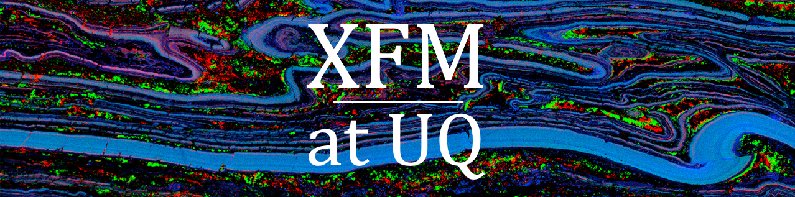
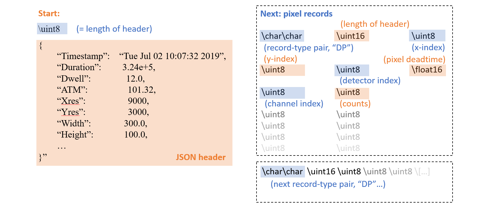

<p align="left">
  
  <br />
</p>

# About the project

XFMParser is a C++/Python tool for parsing X-ray Flourescence Microscopy (XFM) hyperspectral maps, intended as a standalone component accompanying [ReadoutXFM](https://github.com/lachlanc61/ReadoutXFM). It is a C++ implementation of the core read operations from ReadoutXFM, offering greatly improved performance. 

XFMParser/ReadoutXFM are currently compatible with ATLAS-series spectrometers from IXRF Inc., and the GeoPIXE analysis package from CSIRO. It performs parallel read operations on chunks of the binary IXRF/CSIRO ".GeoPIXE" data format, given an array of pixel byte coordinates and lengths, and returns a 3D numpy array of the extracted data via PyBind11. 


# Installation

To set up, simply pip install the package from within your desired virtual environment:

```py
pip install -r .
```


# Usage

The pip installed package can be imported from within python

```py
#within python3
import parsercore

#usage:
result = parsercore.readstream(index_list, pixel_lengths, stream, len(stream) )

```

```py
'''
stream: raw bytes object read from binary IXRF/GeoPIXE format, of type: bytes, length: (len(stream))
index_list: 1/2D numpy array (uint64) of pixel start positions relative to beginning of stream
pixel_lengths: 1/2D numpy array (uint16) of pixel lengths within stream
'''
```


# Testing
Tests are implemented in python around the C++, via pytest:

```py
cd .
pytest
```

# Data format description

The IXRF/CSIRO data format is a highly compact mixed JSON/binary with sparse pixel records (.GeoPIXE).

- Each record contains: 
    - A pixel header specifying statistics related to the following pixel (eg. length of record, coordinates, deadtime).

    - A block of uint8 channel/count pairs containing the spectrum data. Channels where counts are 0 are omitted.  

    - parsercore extracts the uint8 data from these blocks of channel-count pairs, from each pixel position given in index_list

<p align="left">
  
  <br />
</p>
